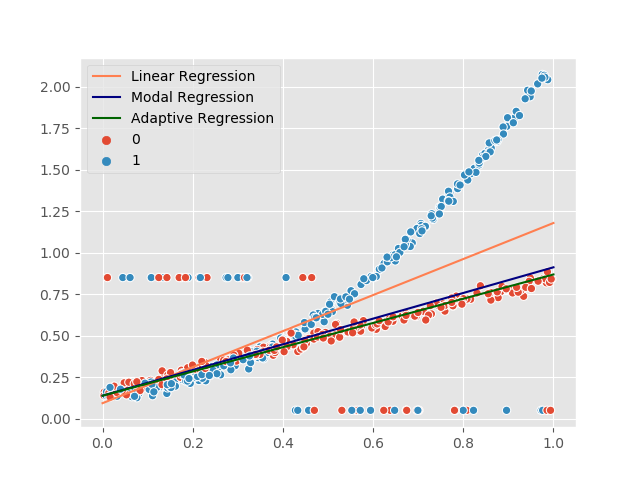

# Robust Adaptive Loss for Mixed Distribution

## Directory
- `main.py`: run experiment
- `data`: synthetic data generating process goes here
- `model`: Code for models goes here. Currently, adaptive lr (`model/adaptive_lr.py`) and modal lr (`model/modal_lr.py`)are implemented 
- `config.yml`: set configuration for the experiment
## Observation 1
Input data is partitioned according to Bern(p=0.5).
One group follows polynomial and another follows linear DGP. Although data is 50/50 split into two sub-groups
the Adaptive loss fits better to linear data (... why?)

## Observation 2
Modal Regression *might* become identical to adaptive loss but modal regression has several parametric assumptions:
1. choice of kernel (In order to use the closed form, kernel has to be Gaussian)
2. the bandwidth parameter needs to be calibrated carefully. Decision boundary is very sensitive to 
this parameter. ModalLR might become essentially identical to LR or adaptive LR based on this parameter.
