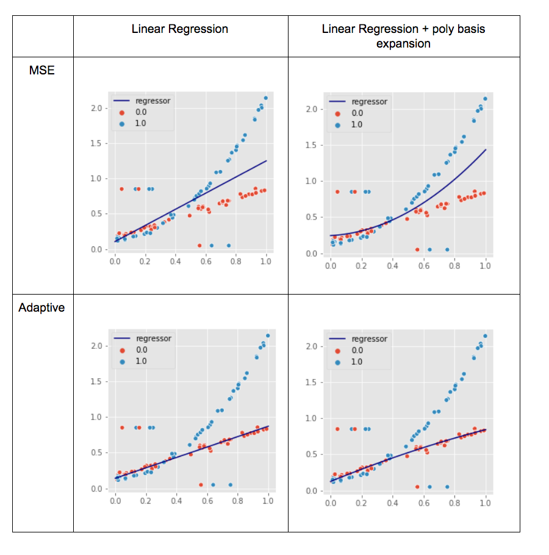

# Robust Adaptive Loss for Mixed Distribution

Input data is partitioned according to Bern(p=0.5).
One group follows polynomial and another follows linear DGP. Although data is 50/50 split into two sub-groups
the Adaptive loss fits better to linear data (.. why?)

